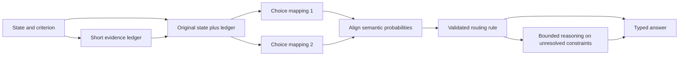

# JevBench leaders and Qwen3.8 intelligence extraction

Research snapshot: 23 September 2026. Three GPT-6 Luna researchers investigated the current
top ten JevBench entries; the coordinating agent inspected NInfer's current decision paths,
checked the central comparisons, and challenged the proposed experiments. This is a research
dossier. It contains no new model measurements or qualified implementation changes.

Implementation follow-up: [Qwen3.8-27B NVFP4 pilot and cache-fidelity finding](qwen3.8-27b-decision-study.md).

## Findings that should guide our work

1. **The reviewed leaders do not reveal a universal inference trick that NInfer lacks.** Most
   open entrants read a restricted set of next-token logits. Several leading rows use trained
   decision adapters. NInfer already exposes exact candidate probabilities, independent questions,
   shared-prefix reuse, and multi-token option likelihoods.
2. **The strongest open question is how much capability our immediate-answer protocol leaves
   unused.** The submitted adapter disables thinking and scores letters at the first output
   position. Qwen's official cards describe thinking as the default. This motivates a controlled
   comparison; it does not establish that reasoning will improve every decision.
3. **Readout design deserves experiments before training a new checkpoint.** Exact answer-slot
   tokenization, question framing, option mapping, short generated answers, and full option-text
   likelihood are materially different choices. Scalar temperature cannot repair a wrong argmax.
4. **Several attractive approaches have negative evidence.** Option-order averaging helps
   reflex's reported configuration but did not improve Jobe's hard accuracy and was rejected by
   JevK5. Calibration and LoRA improvements can fail to transfer to another workload. Extra
   inference should earn its place through paired accuracy and latency measurements.

These findings are supported by the solution profiles and NInfer source map below. Recommended
first work: reproduce the submitted route, compare it with the current native route, and measure
the accuracy-versus-compute curve on independent decisions. Optimize correctness and useful
confidence at measured latency; treat JevBench's tariff-based composite as a separate outcome.

## Coverage and benchmark context

Selection is the top ten ranked rows in the
[v1.4 aggregate artifact](https://github.com/fstandhartinger/jevbench/blob/main/results/v1.4/jevbench-v1.4-results.json).
Jev is closed, so its coverage is limited to official documentation. Open entries were inspected
through source repositories and model cards. Current source can differ from the evaluated
configuration, especially reflex; a repository's latest features are not automatically evidence
about its ranked row.

| Rank | Evaluated entry | v1.4 score | Accuracy on 308 sealed decisions |
|---:|---|---:|---:|
| 1 | Jev 1.13.0 | 63.29 | 36.7% |
| 2 | JevK5 v0.2.0 | 62.04 | 33.1% |
| 3 | Hopper | 59.43 | 34.1% |
| 4 | Winnow-12B Q8 | 55.58 | 33.1% |
| 5 | reflex 4B | 53.99 | 28.2% |
| 6 | djev | 52.23 | 29.9% |
| 7 | metask-jev-4b | 47.78 | 27.6% |
| 8 | SemIf Qwen3.5-4B | 47.69 | 26.3% |
| 9 | Jobe Qwen3.5-4B | 46.94 | 25.6% |
| 10 | local-jev Qwen3.5-4B | 46.80 | 26.0% |
| 26 | NInfer Flash-Next, comparison | 33.98 | 34.1% |
| 35 | NInfer 27B T=1.5, comparison | 26.92 | 33.1% |

The [v1.4 method](https://github.com/fstandhartinger/jevbench/blob/main/docs/METHOD-v1.4.md)
combines accuracy, calibration, speed, and cost, with additional penalties. New sealed tasks have
a different difficulty mix from the old public slice. Neither composite rank nor the
public-to-sealed gap establishes a causal engine defect, model superiority, or training leakage.
The private items and predictions are unavailable, preventing paired error analysis of that set.

## Solution profiles

### Jev: explicit semantics and decomposition

The [official primitives](https://docs.typesafe.ai/primitives) expose Choice, Noul, and Score.
Questions share the same state but are evaluated independently. The
[introduction](https://docs.typesafe.ai/introduction) recommends decomposing complex decisions into
atomic questions and composing results in caller code. Architecture and training cannot be
reconstructed from these docs. **Transfer:** test explicit criteria and decomposition where the
logical combination is known. NInfer already provides independent questions; decomposition can
still compound errors or lose interactions between facts.

### JevK5: distill reasoning into immediate decisions

[JevK5 v0.2.0](https://github.com/allebee/jevk5/tree/v0.2.0) uses a Qwen3.5-4B LoRA distilled
from thinking Qwen3.6-27B. Its published recipe independently checks generated teacher answers
twice, mixes teacher and human-labeled tasks, and trains on option logits, including soft targets
when available. The [runtime](https://github.com/allebee/jevk5/blob/v0.2.0/jevk5/runtime.py)
projects the final hidden state onto answer-letter rows and uses CUDA Graph replay.

The author's public-hard ablation reports 61.3% for the base and 73.9% for v0.2, with two standard
items regressing. Per-type temperatures and two-order averaging were tested and rejected.
**Transfer:** the teacher/student recipe is evidence for a separate distillation study. Its speed
optimization is not a new reasoning algorithm. Applying its quality intervention requires new
weights; it cannot be copied into a frozen Qwen3.8 artifact as a runtime switch.

### Hopper: trained decision behavior plus calibration

[Hopper](https://huggingface.co/HopitAI/hopper) serves Qwen3.5-4B with a merged LoRA.
Its [model](https://github.com/hopit-ai/hopper/blob/v1.1.0/hopper_decisions/model.py) and
[request mapping](https://github.com/hopit-ai/hopper/blob/v1.1.0/hopper_decisions/request.py)
use thinking-off letter readout. Shipped
[calibration](https://github.com/hopit-ai/hopper/blob/v1.1.0/hopper_decisions/calibration.py)
uses separate temperatures for question types. The reviewed material does not establish a
controlled frozen-base accuracy improvement from calibration or disclose a complete training
recipe. **Transfer:** isolate prompt and type semantics from weight changes; calibrate only after
selecting the decision method. Its temperature values are not portable constants.

### Winnow: trained Gemma, conventional decision serving

[Winnow-12B](https://huggingface.co/EldanRing/Winnow-12B) is a Gemma 4 12B IT LoRA merged and
exported as Q8_0 GGUF. Its
[serving interface](https://github.com/EldanRing/winnow-inference/blob/main/docs/API.md)
branches questions from a shared state and normalizes answer-label logits. The model card
describes curated training with contrastive fact variations; the private corpus limits independent
assessment. **Transfer:** contrastive examples that change one decisive fact are useful evaluation
fixtures. Replicating the trained behavior requires a new checkpoint. Entropy over options is
concentration, not a verified probability of correctness.

### reflex: the most useful positive and negative ablations

The ranked 4B entry uses a LoRA, but the current
[stable manifest](https://github.com/kshetrajna12/reflex/blob/main/serving/stable.json) selects the
frozen base, default prompt, no calibration file, and two distinct option orders.
The [prompt](https://github.com/kshetrajna12/reflex/blob/main/src/reflex/prompt.py) separates
Evidence, Criterion, and Options; the
[engine](https://github.com/kshetrajna12/reflex/blob/main/src/reflex/engine.py) maps each order's
probabilities back to semantic options before averaging.

The manifest reports public-hard accuracy moving from 65.8% to 68.5% for this order intervention.
The [project's account](https://github.com/kshetrajna12/reflex) also reports failed transfer from
training, prompt optimization, additional orders, and reasoning cascades. **Transfer:** test two
orders and explicit framing on Qwen3.8. Preserve the negative findings as reasons to require a
target-specific ablation, and distinguish current stable settings from the benchmarked LoRA row.

### djev: exploit a diffusion decoder's native answer slots

[djev's compiler](https://github.com/Davipar/djev-dev/blob/main/djev/engine.py) creates a fixed
template with noisy answer positions, verifies that allowed labels occupy the intended token
slots, and requests exact label probabilities after one denoising step.
The [architecture](https://github.com/Davipar/djev-dev/blob/main/docs/architecture.md) explains
compact canvases and independent question reads; no new weights are trained. **Transfer:** exact
answer-slot validation and avoiding unnecessary output work are useful. Bidirectional diffusion
canvas inference cannot be transplanted into autoregressive Qwen as a decoding flag.

JevBench's separate
[djev thinking experiment](https://github.com/fstandhartinger/jevbench/blob/main/docs/v1.2-additions-djev-thinking.md)
uses full generation and parsed probabilities, not the public one-step API. It motivates examining
compute budgets but confounds the readout, generation, and probability-reporting methods; it is
not a controlled proof that adding reasoning will improve NInfer's native probabilities.

### SemIf: answer-boundary checks and workload calibration

[SemIf's direct readout](https://github.com/TheoLeeCJ/SemIf-OpenJev/blob/master/src/semif_phase1/direct.py)
checks exact single-token labels and verifies that appending an answer does not retokenize the
prompt tail. It records selected logits and prompt provenance. Its
[reported results](https://github.com/TheoLeeCJ/openjev) cover prefix reuse and workload-specific
calibration, with explicit limits on small-set and cross-runtime comparisons.
**Transfer:** verify the exact answer boundary, including whitespace and template markers.
Calibrate against the intended workload. Neither cached execution nor a small authored set proves
semantic equivalence or general performance.

### Jobe: inspect failed interventions before repeating them

[Jobe's slots](https://github.com/MantisShrimpdev/jobe/blob/master/src/jobe/slots.py) validate
one-token round trips and boundary stability; its
[readout](https://github.com/MantisShrimpdev/jobe/blob/master/src/jobe/readout.py) normalizes
declared option logits. The [project report](https://github.com/MantisShrimpdev/jobe) says order
averaging doubled reads with unchanged public-hard accuracy of 61.3%. A reasoning gate produced
threshold-dependent outcomes on small subsets. **Transfer:** use disagreement as a diagnostic,
then test whether a corrective action actually fixes errors. Confidence, disagreement, and extra
reasoning are not reliable policies without held-out outcomes. Repeated wrong answers alone do
not identify the cause as missing knowledge.

### local-jev: ordinary frozen logits, careful prefix reuse

[local-jev's backend](https://github.com/amithgc/local-jev/blob/main/src/local_jev/backends/llm.py)
disables thinking, reads letter logits, groups shared states, and batches suffixes while limiting
padding. Its [reported evaluation](https://github.com/amithgc/local-jev) describes weak transfer
from a small authored set and an ensemble that lost to its stronger component.
**Transfer:** compare realistic workloads and reuse existing prefix machinery. This review found
no demonstrated inference-only intelligence gain here beyond techniques already available in
NInfer.

### metask: specialized training and explicit answer slots

[metask's scorer](https://github.com/metask-ai/metask-jev/blob/main/inference/jev_scorer.py)
and [schema](https://github.com/metask-ai/metask-jev/blob/main/inference/jev_schema.py) implement
one-pass candidate scoring with explicit token-slot checks. The
[policy-mix card](https://huggingface.co/wayfind/metask-jev-4b-policy-mix) describes rank-16 LoRA,
candidate-choice training, per-type calibration, and synthetic tasks modeled on hard decision
families. **Transfer:** precise criteria and validated output slots can be tested with frozen
weights. Its trained behavior requires a new artifact, and benchmark-directed development is
insufficient evidence of performance on our eventual workloads.

## What NInfer already has, and what remains unproven

This comparison uses the current `research/qwen4-flash-next` working tree, including existing
uncommitted System One work. It does not assert that those files match the evaluator's binary.

| Surface | Observed behavior | Implication for this research |
|---|---|---|
| [Submitted adapter](../../tools/bench/jevbench/ninfer_native.py) | All task types become A-Z options; first output position; thinking off; `max_tokens=1`; raw candidate-logprob softmax; outside-candidate mass recorded | The submitted row tests this specific protocol, not all Qwen capabilities |
| [Python shim](../../tools/bench/jevbench/typesafe_shim.py) | Reuses that prompt; choices inherit criteria order rather than a separate dataset label order | Freeze mapping and order when reproducing the submission |
| [Native System One](../../src/serve/typesafe_systemone_http.cpp) | Yes/No for binary questions, numeric score tokens, up to 62 choices, independent branches, shared prefix, temperature scaling | Native and submitted prompts/labels differ; compare them before attributing a change to the engine |
| [Native closed-set score](../../src/serve/ninfer_score_http.cpp) | Single-token candidate scores or summed multi-token continuation logprobs; entropy, margin, outside mass; independent questions | Semantic option-text scoring is already possible; it needs an evaluation, not a new scoring API |
| [Chat serving contract](../serving.md) | Native logprobs before sampler adjustments; prompt-position readout; thinking controls and a process thinking-budget cap | Reasoning experiments must score the actual answer boundary, not the first reasoning token |
| [Capability evaluation](../../eval/README.md) | External/local server targets and existing Qwen reasoning campaigns | Reuse the evaluation infrastructure where it fits; do not build a second inference implementation |

The [candidate readout tests](../../tests/test_token_logprobs.cpp) already exercise raw and masked
normalization. The inspected serving preparation checks that each candidate string tokenizes to
one token in [generation_service.cpp](../../src/serve/generation_service.cpp). That alone is not
the stronger prompt-plus-answer retokenization invariant used by SemIf/Jobe. Verify this boundary
on representative real rendered prompts before calling it a bug or adding machinery.

[Qwen3.8-27B](https://huggingface.co/Qwen/Qwen3.8-27B) and
[Flash-Next](https://huggingface.co/Qwen/Qwen3.8-Flash-Next) describe thinking as the default and
publish generation settings. Those sampling settings do not automatically improve an argmax over
raw first-position logits: NInfer's raw readout precedes sampling adjustments. Generation budgets,
template rendering, retained reasoning history, and the scoring position must be explicit.

## Experiments ordered by decision value

All items below are hypotheses for Qwen3.8, not measured gains. The implementation study targets
**Qwen3.8-27B NVFP4 only**, following the user's hardware-accessibility decision. Establish one
reproducible baseline and change one factor at a time before combining
successful interventions.

| Order | Experiment | Question it resolves | Comparison and adoption rule |
|---:|---|---|---|
| 0 | Submission/native-route reproduction and fidelity | Is the observed limitation in a protocol, precision profile, or execution path? | Record actual template tokens, option IDs, candidate mass, KV/weight format and outputs. Match prompts across a qualified reference runtime when available. Investigate meaningful probability/choice drift; no requirement for bitwise cross-engine equality |
| 1 | Immediate logits vs short answer vs bounded reasoning | Does giving this Qwen checkpoint more output computation recover correct decisions? | Compare direct readout, a short non-thinking answer, and thinking budgets 128/512/2048. Expand to larger budgets if accuracy is still improving. Report corrected and newly broken items, validity, latency and tokens. Choose an accuracy/latency frontier, not an arbitrary universal cap |
| 2 | Answer framing and token semantics | Does arbitrary letter mapping hide useful instruction-following behavior? | Factor native Yes/No or numeric labels separately from Evidence/Criterion/Options framing; keep criterion and information identical. Select on development data, confirm on untouched scenarios |
| 3 | Two option mappings | Is position bias both present and correctable? | Score two distinct mappings, align by semantic ID, compare each order and their average. For ordinal questions preserve level meanings and canonical order; do not reverse the scale accidentally. Keep only if held-out outcome gains justify extra work |
| 4 | Semantic option-text likelihood | Does evaluating the actual option text outperform letter selection? | Use existing `/v1/score`; compare sum log-likelihood, length-normalized score, and matched-length controls as distinct scorers. Check shared prefixes and tokenization. Raw sequence likelihood favors short/common text and is not automatically a calibrated class probability |
| 5 | Contextual bias correction and calibration | Are systematic label priors or probability miscalibration limiting use? | Contrast ordinary scalar temperature with a separately validated prior correction; fit only on calibration data. Temperature must preserve argmax; prior correction can change it and needs an accuracy test |
| 6 | Selective extra reasoning or verification | Can difficult decisions receive more compute efficiently? | Compare max-probability routing with task type, candidate mass, mapping disagreement and validator results. Freeze routing thresholds before evaluation; measure error at fixed coverage and actual end-to-end compute, including the failed first pass |
| 7 | Distill a qualified reasoning route into decisions | Can a proven accuracy gain be retained at one-pass speed? | Only after defining a better teacher: train a separate derived checkpoint on independently checked tasks and soft targets where meaningful. Confirm unseen domains and general chat/tool quality; adaptation requires artifact qualification |

Supporting literature supplies hypotheses, not Qwen-specific acceptance:
[Look at the Text](https://arxiv.org/abs/2404.08382) finds first-token versus generated-answer
mismatches in instruction-tuned models;
[Calibrate Before Use](https://arxiv.org/abs/2102.09690) studies content-free prior calibration;
[PriDe](https://arxiv.org/abs/2309.03882) studies option-ID bias. A content-free question may
legitimately favor abstention or certain labels, so flattening its prior can erase useful evidence.
None of these papers establishes a gain on our checkpoints.

### Reasoning readout must remain well-defined

Turning `enable_thinking` on while retaining `max_tokens=1` and reading the first position does
not perform this experiment. Generate a bounded reasoning sequence, identify the canonical
reasoning close and answer start, and evaluate allowed answer tokens at that boundary. Keep
forced control tokens and exhausted budgets explicit. If a second scoring request reconstructs
the history, verify it preserves the intended reasoning tokens and assistant continuation.

A distribution conditioned on one generated rationale is not the model's marginal decision
distribution over all possible rationales. Report native post-reasoning probabilities separately
from parsed verbal probabilities or sample frequencies. Include invalid/missing answers as
failures, and do not interpret a fluent rationale as evidence that its reasoning is correct.

## Proposed synthesis: evidence first, then test decision stability

This is an untested composition of known techniques tailored to NInfer's existing interfaces.
It is a candidate for experiment, not a claim of research novelty.

For long policies, arithmetic, and multi-hop decisions, ask Qwen to produce a short structured
ledger of relevant facts, constraints, and unresolved facts before it sees arbitrary answer-letter
assignments. Preserve the full original state and criterion for the eventual decision; the ledger
must not become an information bottleneck. Then score two semantic-preserving option mappings
from a shared prefix containing that evidence. If their mapped answers disagree or a check fails,
spend a larger reasoning budget on the specific unresolved constraint.

The mechanism we want to test is separation of evidence extraction from arbitrary label preference.
For tasks requiring the candidate descriptions to identify relevant evidence, include their
semantics without arbitrary IDs; also retain a normal option-aware baseline. An option-blind
ledger can omit exactly the fact that makes one option correct.

Necessary controls are direct scoring, direct reasoning, ledger plus one order, two orders without
a ledger, and the combined method at matched total compute. A manually checked ledger can be an
upper-bound diagnostic on our own tasks; it must never enter the scored production method. Check
ledger hallucinations, omitted exceptions, changed answers that were previously correct, and
calibration after routing. Correlated agreement can still be confidently wrong.

Use existing public Engine requests and independent state branches. A custom attention mask does
not by itself isolate Qwen's recurrent GDN state. The existing
[state/cache ownership contract](../maintainer/resource-scheduling-and-context-cache.md) applies
to any parallel experiment. No diffusion decoder, second resident model, or hypothetical runtime
architecture is required for the initial study.

## Evaluation and decision rules

- Use a scenario-level development/calibration/test split, with paraphrases and related documents
  kept together. Include externally labeled tasks plus newly constructed exact-oracle cases for
  dates, arithmetic, rule precedence, long policies, multi-hop lookup, ambiguity and judgments.
  Review generated labels independently; agreement between teacher samples is not ground truth.
- Preserve the JevBench public adapter run as a reproducibility check. Do not repeatedly select
  prompts on its 231 public items or seek private sealed answers. Freeze configurations before
  a future official submission and label a reasoning entrant accurately.
- Measure paired accuracy and family accuracy, NLL/Brier/ECE where the output is a distribution,
  invalid answers, risk versus coverage, and p50/p95 latency and actual token/compute use. Use
  scenario-level uncertainty estimates. A small pilot selects experiments; it does not establish
  a broad capability claim.
- Keep prompt content, artifact, template, KV format, reasoning settings, and concurrency fixed
  except for the variable being tested. A reference-runtime comparison must distinguish different
  weights from runtime arithmetic. Existing quantized artifacts are not assumed equivalent to
  a BF16 source model without evidence.
- Predeclare a useful gain and latency budget for the intended workload before the final test.
  Advance an intervention when its held-out paired benefit is clear enough for that decision and
  supported families do not materially regress. Report an inconclusive result as inconclusive.
  Calibrate probabilities after choosing the method; do not use a lower ECE to claim more correct
  decisions.

JevBench's own
[combination experiments](https://github.com/fstandhartinger/jevbench/blob/main/RESULTS-COMBINATIONS.md)
found that committees, cascades, and real repeated samples did not improve its ranked board under
that experiment's scoring. Its linked
[option-order diagnostic](https://github.com/fstandhartinger/jevbench/issues/40) is explicitly
separate from the score. These are useful negative controls and methodological references, not
proof that a Qwen3.8-specific policy will fail.

## Deliverable boundary

The review covers nine open solutions and the closed leader's public contract, their transferable
techniques and known limits, today's NInfer affordances, and a falsifiable experiment sequence.
No benchmark was rerun, no weight or dependency was downloaded, no training or production change
was made, and no proposed quality improvement is established yet. The recommended next
implementation deliverable is a paired decision-evaluation study for experiments 0-3, using the
existing serving paths; later work should follow the measured failure modes.
